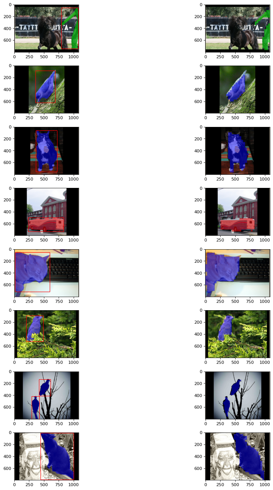
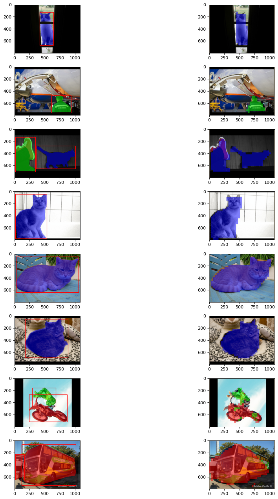

# SOLO: Segmenting Objects by Locations

## Overview

[SOLO](https://arxiv.org/abs/1912.04488) is a method for instance segmentation. This repository provides an implementation of the SOLO model as described in the paper. This repository provides an implementation and results of the SOLO model. 

## Visual Results
For each paired image below, the left showcases the ground truth while the right highlights the model's predictions. 



<!-- Add more images or results as needed -->
    
## Dataset 
This project utilizes a simplified version of the COCO dataset. The modified dataset contains three classes across 3265 images: vehicles, people, and animals. The data can be downloaded from [here](https://drive.google.com/drive/folders/1eP7FtPaWfJ5zLdcsZYl6eyn5EYixkFn8).
    
## Getting Started
    
### Prerequisites
The following packages and versions were used in this project:
- wandb 0.15.12
- pytorch-lightning 2.0.8
- torch 2.0.1
- torchvision 0.15.2
- matplotlib
- h5py

### Installation & Usage
    
```bash
# Clone the repo:
git clone https://github.com/root221/solo.git
    
# Navigate to the project directory and install required packages:
cd SOLO
pip install -r requirements.txt
    
# Download the data from the above link and place it in the 'data' directory 
    
# For training and testing, simply run the following:
python solo.py
    
